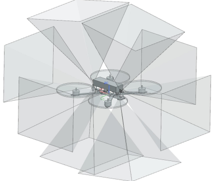
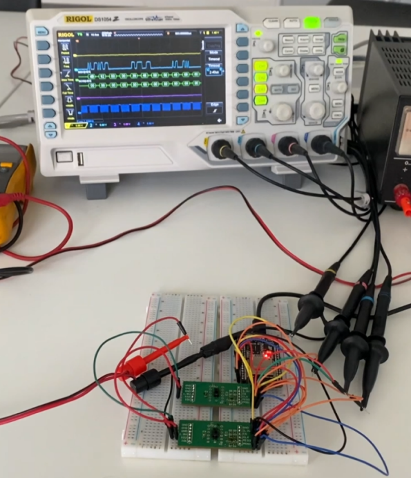

# Drone depth sense

## 1. What is this?

This is embedded C++ firmware, written for the ESP32 (Arduino) platform. Its primary function is to process ranging data from two VL53L8CX Time-of-Flight (ToF) sensors for rudimentary proximity based collision avoidance.

This code serves as a PoC for the sensor integration.  

**Note:** The motor interface currently relies on a basic serial CLI protocol for the motor controller. This is non-optimal for a final flight system (e.g., it does not use standard protocols like MAVLink or a iNav's API) but was the fastest solution to validate the sensor and control logic for the demo.

---

## 2. Features

The project focused on building a full stack embedded solution for omnidirectional depth perception under severe size constraints

* **dual sensor SPI Management:** Developed low level firmware utilizing the ST Ultra Lite Driver (ULD) to reliably manage and poll **two** VL53L8CX sensors simultaneously over the ESP32's shared SPI bus, using dedicated Chip Select lines to enable high-speed, dual-sensor ranging (approx. 15 Hz combined).
* **real time 3D point cloud transformation:** Achieved high speed conversion of the raw 8x8 distance matrices (64 points per sensor) into a unified **global XYZ coordinate system** by applying pre-calibrated rotation and translation matrices. This is essential for accurate spatial interpretation by downstream avoidance algorithms.
* **sector based proximity control:** Implemented a low latency control loop that analyzes the Left/Right depth sectors of the combined FOV and translates perceived proximity directly into a proportional motor speed decrease via a Serial CLI interface. This demonstrates the feasibility of closed-loop avoidance control.
* **high bandwidth telemetry stack:** Established the ESP32 as a WiFi Access Point for streaming the full, raw XYZ depth data (point cloud) over a dedicated **TCP socket** (Port 8080), which is critical for real-time external visualization, debugging, and external algorithm development.

## 3. Initial configuration

System parameters and hardware pins must be defined in `main.cpp`.

| Parameter       | Default Value      | Purpose                              |
|-----------------|-----------------|--------------------------------------|
| WIFI_SSID       | "esp32"          | WiFi AP Name                          |
| WIFI_PASSWORD   | "12345678xd"     | WiFi AP Password                      |
| SERVER_PORT     | 8080             | TCP Listener Port                     |
| SENSOR1_CS_PIN  | 4                | SPI Chip Select for TOP Sensor        |
| SENSOR2_CS_PIN  | 5                | SPI Chip Select for BOTTOM Sensor     |
| RX1_PIN/TX1_PIN | 16/17            | Motor Controller UART Pins (Serial1) |

## 4. Motor Mapping (SensorProcessor)

`SensorProcessor` calculates command values which are then passed to `MotorController`. Speed values are clamped and mapped from the range **150mm → MAX_SPEED_ADJ** to **1000mm → MIN_SPEED_ADJ**.

| Motor Index | Controlled By     | Region      |
|-------------|-----------------|------------|
| 0           | Sensor 1 (TOP)   | Left FOV   |
| 1           | Sensor 1 (TOP)   | Right FOV  |
| 2           | Sensor 2 (BOTTOM)| Left FOV   |
| 3           | Sensor 2 (BOTTOM)| Right FOV  |

**Note:** Motor speeds are defined in `MotorController.h`. `1000` is the motor off value.

---

## 5. Build Notes

- Requires the ESP32 platform in your Arduino environment  
- SPI is initialized at 1MHz (`SPI_MODE3`)  
- Startup checks ensure both sensors are responding before the control loop starts. If initialization fails, the ESP32 restarts (`ESP.restart()`)  
- Monitor Serial output at `115200 Baud` for system status and detailed logs  

---

## 6. To Do / Future Work
- Visualization Software: Add the dedicated Python visualization software to the repository. This tool is necessary for interpreting the streamed XYZ point cloud data over TCP/IP.
- Obstacle Avoidance: Implement a robust, dedicated obstacle avoidance algorithm suitable for integration with a flight controller. The current implementation is a PoC demonstration of the sensor pipeline, but the ultimate goal is full deployment onto the drone platform.

---

## 7. Acknowledgments

This project was built together with **Cedric and Arthur**.

- Cedric and Arthur were responsible for the hardware and electrical engineering setup, including the design of the custom 3D printed sensor mounts as well as the soldering
- Cedric also provided significant help in developing the low level SPI reading code (as well as the debugging)  
- The entire project was tested using Cedric's drone

